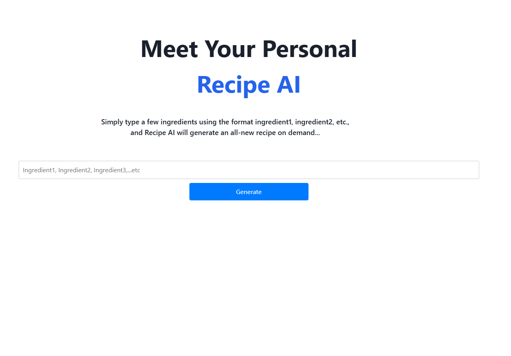

# Serverless Web Application using Generative AI >

[**Download my CV here**](https://collinsawsbucketlist.s3.us-east-1.amazonaws.com/AWS_S3/CV+-+Collins+Amalimeh.pdf)

 ### This is a serverless web app that uses Amazon’s Cloud 3 Sonnet model to generate recipes based on user-provided ingredients. 

> 
> To build such an application, one must first possess the necessary knowledge of AWS services and be able to do the following:

 - **Create a new AWS account.**
 - **Configure users and Setup Environment.**
- **Set up the AWS CLI,**
- **Familiarity with Git and Github account.**

 ## Application Architecture
 

## Feactured UI Interfaces

- **Sign Up Page**


- **Sign in Page**


- **Home Screen**  


- **Sample: Generating a recipe _( Famous Hungarian beef soup - Gulyás (Goulash Soup) )_**


- **Password Reset Page**


## Technologies used includes several `Amazon Web Services`, listed below:  

- **AWS Amplify**
- **AWS Amplify Auth (Amazon Cognito)**
- **AWS Lambda**
- **Amazon Bedrock**
- **Amazon Claude 3 Sonnet**
  
## 

## Technology Description ###

| AWS Service | Description |
| ----------- | ----------- |
| **AWS Amplify** | A comprehensive set of tools and services that help developers build and deploy scalable mobile and web applications quickly and easily. <br/>It includes features such as authentication, APIs, storage, hosting, and more, all backed by the reliability and scalability of the AWS cloud.
| **Amazon Cognito** | used to implement user authentication and authorization for web and mobile applications.
| **AWS Lambda** | AWS compute service that you can use to build applications without provisioning or managing servers.
| **Amazon Bedrock** | AWS fully managed service that offers foundation AI models for building generative AI applications.
| **Claude 3 Sonnet** | The very AI model  used in this application, is teh first Claude model to offer extended thinking, the ability to solve complex problems with careful, step-by-step reasoning.|
## 

[**Go back to Top** ](#serverless-web-application-using-generative-ai)

## 
[**Download my CV**](https://collinsawsbucketlist.s3.us-east-1.amazonaws.com/AWS_S3/CV+-+Collins+Amalimeh.pdf)


:yum: [**Check out this app**](https://main.dsowentchwvt2.amplifyapp.com/)

```
  My sincere thanks for taking your time to view my project. 
  
  I hope you found it interesting, or at least it inspired you. 
  
  Are you a in this IT realm like me and looking for entry level positions?  
  
  Do not be discouraged. 
```

@ Collins Chinedu Amalimeh